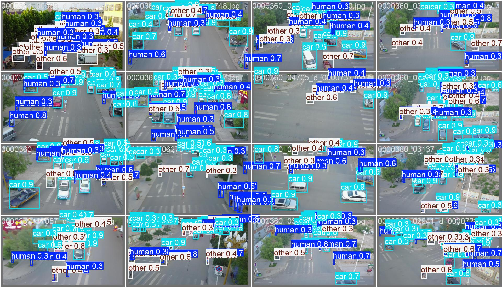
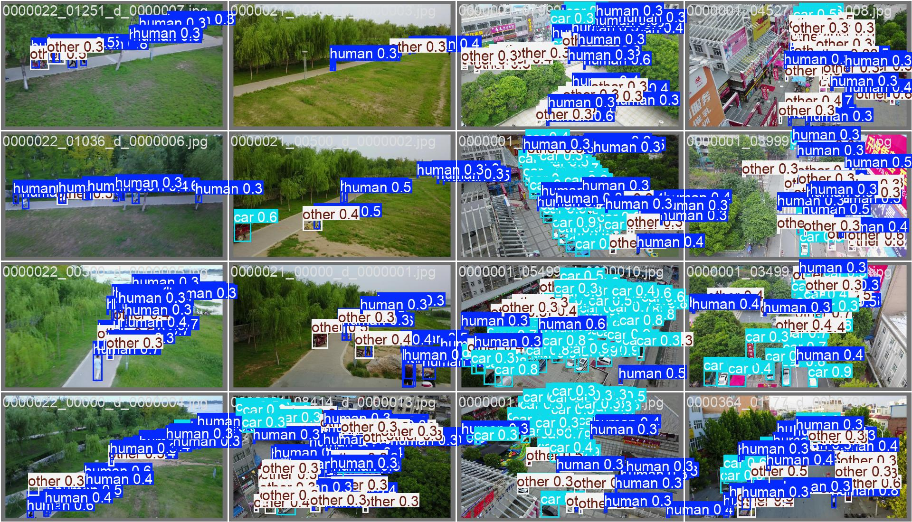
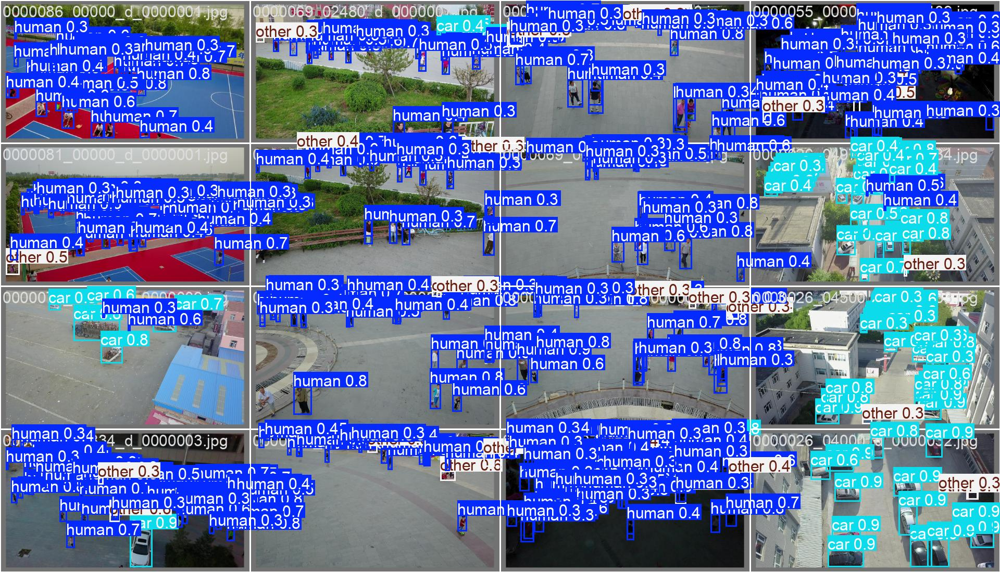
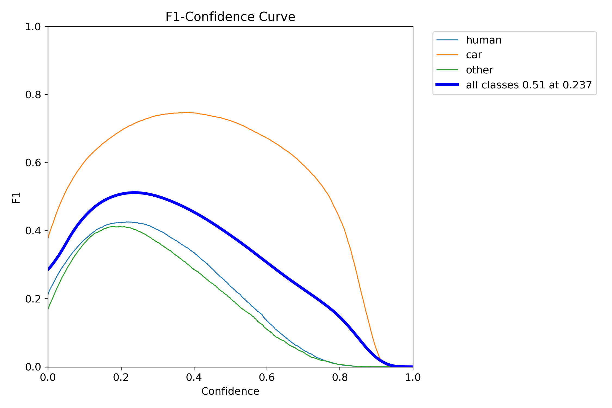
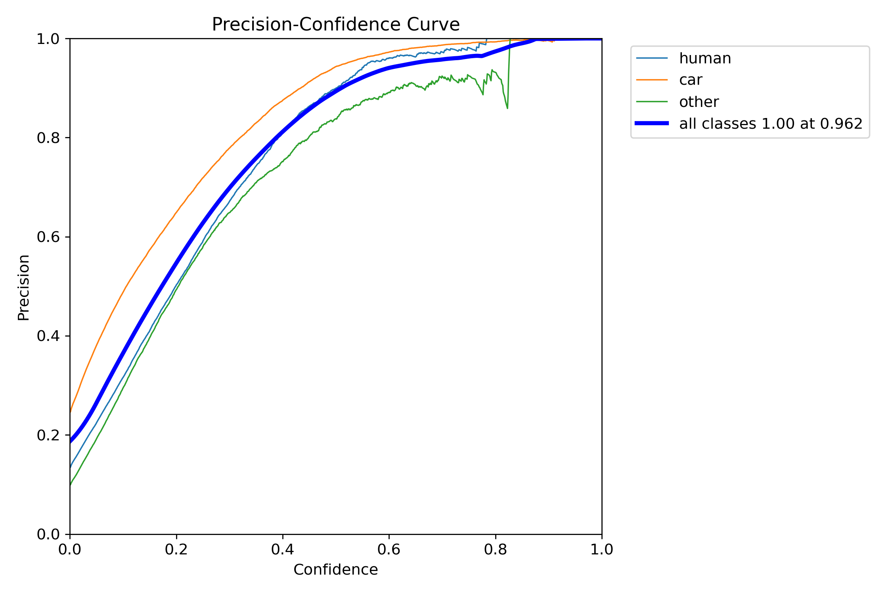
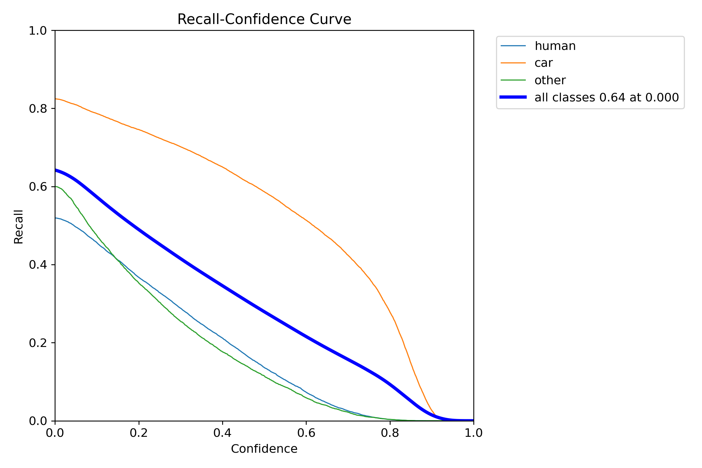
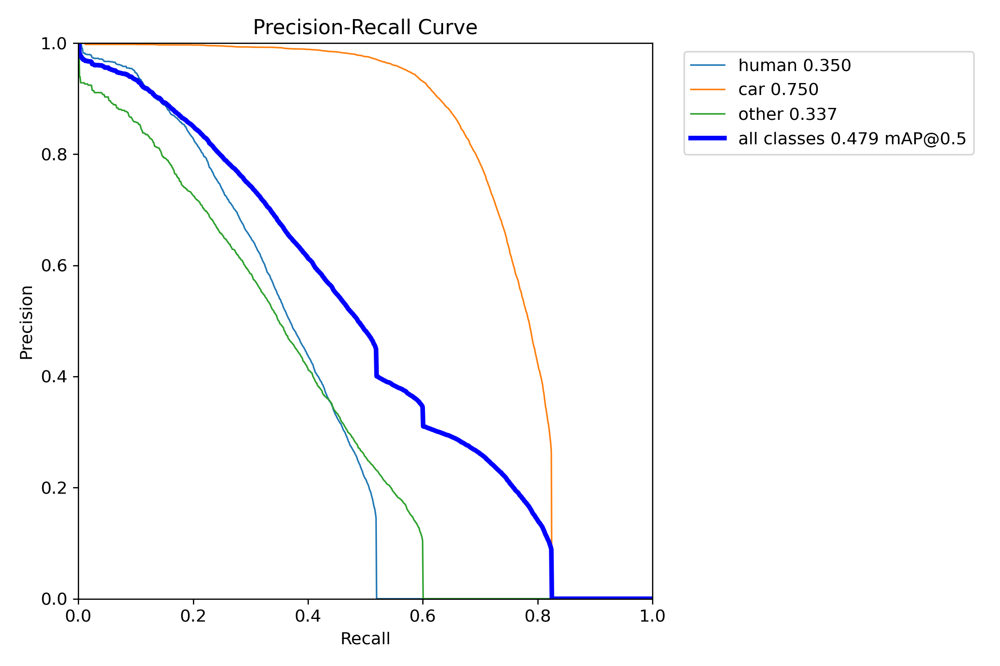
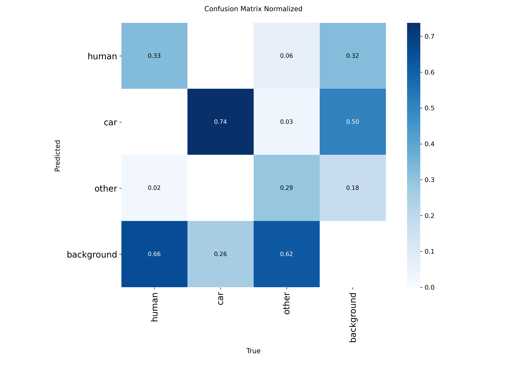

**ANTLINGS** — VisDrone Object Detection with YOLOv8

## PROJECT OVERVIEW

This project fine-tunes a YOLOv8n (nano) model on a remapped subset of the
VisDrone2019 dataset to detect three object categories from drone imagery:
    - human  (pedestrians and people)
    - car    (cars, vans, trucks, buses)
    - other  (bicycles, tricycles, motorcycles, and miscellaneous objects)

The notebook (Antlings_mahmud.ipynb) covers the full pipeline: data ingestion, class remapping, **YOLO**-format preprocessing, model training, inference, and evaluation with visual diagnostics.
Final human counting and object tracking output using this model: <https://drive.google.com/drive/folders/1YrYvaSve1KMpgk45B7evi4XYXjLsYzxo?usp=drive_link>

# FILE MANIFEST
    Antlings_mahmud.ipynb           - Main training & evaluation notebook
    antlings_app.py                 - Object tracking script (plus counting logic is implemented here as well)
    antlings_human_count.py         - script for counting human in a static image
    visdrone_human_car-4            - the trained model file
    model_params                    - model performance evaluaton graphs, confusion matrix and sample model validation outputs
    README.txt                      - This file

# SECTION 1 — DATASET UNDERSTANDING & PREPROCESSING

## SOURCE DATASET
Dataset : VisDrone2019-**DET** (Detection Task)
Origin  : Drone-captured imagery, shared by the **ANTS** team in assesment file
Splits used:
    - VisDrone2019-**DET**-train  →  6,**471** images
    - VisDrone2019-**DET**-val    →    **548** images

The raw archive is stored in Google Drive and extracted via: !unzip -q archive.zip -d /content/drive/MyDrive/Antlings_Visdrone/visdrone

## CLASS REMAPPING

The original VisDrone dataset has 12 fine-grained categories. These are collapsed into 3 super-classes for this project:

    New ID | New Name | Original VisDrone Classes Included
    -------|----------|--------------------------------------------
    0    | human    | pedestrian (0), people (1)
    1    | car      | car (3), van (4), truck (5), bus (8)
    2    | other    | bicycle (2), tricycle (6), awning-tricycle (7),
                    | motor (9), others (10)

  *Note: At first I tried to map only car, people and pedestrian but that resulted in very poor performance of the model as it skipped most of the dataset. So merging a lot different objects under those 3 super classes resulted in better data handling and more training efficiency* 

The remapping is applied at preprocessing time. Each raw label file is parsed line-by-line, and only lines whose original class ID appears in CLASS_MAP are kept; the class ID is replaced with the new super-class ID. All bounding-box coordinates (**YOLO** normalized cx, cy, w, h) are preserved. 

## CUSTOM DATASET LAYOUT

Output is written to:

    visdrone_custom/
    ├── images/
    │   ├── train/
    │   └── val/
    └── labels/
    ├── train/  
    └── val/    

A data.yaml configuration file points to the custom root and lists the three class names (human, car, other) for Ultralytics training.

## ANNOTATION FORMAT

Each label file follows the **YOLO** format — one bounding box per line: <class_id> <x_center> <y_center> <width> <height> All values are normalized to [0, 1] relative to image dimensions.

# SECTION 2 — TRAINING APPROACH

## BASE MODEL
    Architecture : YOLOv8n (nano variant — lightest YOLOv8 backbone)
    Pretrained   : Yes — initialized from yolov8n.pt (COCO  weights)
    Framework    : Ultralytics 8.4.51

The pretrained head is replaced and re-initialized for nc=3 classes.

## TRAINING CONFIGURATION

    Parameter         | Value
    ------------------|-------------------
    epochs            | 32
    imgsz             | 640 px
    batch             | 16
    optimizer         | auto (AdamW)
    Hardware          | Tesla T4 GPU on Google Colab

*Note: after 29 epoch Google Colab terminated the GPU-runtime as I use free version of the Colab. I saved the checkpoint locally and tried to train using cpu, it took 2hrs(approx) to execute 1st epoch. But I have time limitations and cannot wait days for model to be trained; due to this I had to work with 29 epochs and this is one of the major reasons why model struggles with identifying humans which will discussed in the **evaluation** section later* 

## AUGMENTATION PIPELINE

    - Mosaic (4-image collage, enabled for first 22 epochs)
    - Random horizontal flip (p = 0.5)
    - HSV color jitter (hue, saturation, value)
    - Random erasing (p = 0.4)
    - RandAugment auto-augmentation policy

## SAMPLE INFERENCE OUTPUT (Validation Set)

# SECTION 3 — EVALUATION & VISUALIZATION
## VALIDATION SETUP
    Validation images : 548
    Total instances   : 38,759 bounding boxes
    IoU threshold     : 0.50 (mAP@0.5)
    Hardware (val)    : Colab CPU runtime (lost access to gpu-runtime by then)
    Speed             : ~2.0 ms preprocess | ~143 ms inference | ~6.7 ms postprocess

*Note: The training run used a Tesla T4 GPU; inference speed on GPU would be significantly higher, but it was done on CPU*

------------------------------------------------------------
## CURVE-BASED DIAGNOSTICS

Metric Definitions:
    Precision    — Of all predicted boxes, what fraction are correct.
    Recall       — Of all ground-truth boxes, what fraction are found.
    mAP@0.5      — Mean Average Precision at IoU threshold 0.50.
    mAP@0.5:0.95 — mAP averaged over IoU thresholds 0.50–0.95 (**COCO** metric).

# F1-Confidence Curve 
    - Best overall F1 : 0.51 at confidence threshold 0.**237**
    - car peaks at F1 ≈ 0.75, the strongest class
    - human and other plateau near F1 ≈ 0.42
    - All classes drop sharply beyond confidence 0.6, indicating the model is
    more conservative at high-confidence thresholds

# Precision-Confidence Curve  
    - Precision reaches 1.00 at confidence ≈ 0.962 for all classes
    - car achieves high precision earliest (rises steeply from low confidence)
    - All classes converge to near-perfect precision above 0.90 confidence

# Recall-Confidence Curve 
    - Maximum recall (all classes): 0.64 at confidence 0.000
    - car recall starts at 0.82 and stays high until confidence ≈ 0.7
    - human and other recall drops quickly — starts at ~0.52–0.60 and
    falls below 0.1 by confidence 0.7
    - Indicates the model misses many small or partially occluded objects
    at higher thresholds

# Precision-Recall Curve  (BoxPR_curve.png)
    - mAP@0.5 (area under curve):
    human : 0.350
    car   : 0.750
    other : 0.337
    ALL   : 0.479
    - car PR curve is wide (recall up to ~0.82 at high precision), reflecting
    the strong detectability of vehicle shapes from drone altitude
    - human and *other* PR curves are narrow, confirming low recall for
    small, cluttered targets

 # CONFUSION MATRIX ANALYSIS Raw Counts ():

Key Observations:
    
    1. CAR detection is strongest: 74% of true cars are correctly detected.
    However, 26% of true cars are missed (false negatives / background).

    2. HUMAN detection is weak: only 33% of true humans are detected correctly.
    66% of true humans are classified as background (missed entirely), and
    another 32% of background predictions are actually true human objects
    that the model confidently but wrongly suppresses.

    3. OTHER class struggles similarly: 29% true-positive rate, with 62% of
    true other objects falling into background (missed).

    4. High false-negative rates are consistent with the VisDrone challenge —
    objects are small, dense, and often partially occluded, making recall
    the key limiting factor across all classes.

    5. Cross-class confusion is low: misclassification between human/car/other
    is minimal (e.g., only 0.06 of true other are predicted as *human*),
    meaning the model's class boundaries are reasonable once it detects.

# What would have improved the model more

    1. If used a larger YOLOv8 variant (YOLOv8s / YOLOv8m) for more capacity
    2. Increased input resolution (e.g., 1280px) to preserve small object detail
    4. Adding more epochs (50–100)

